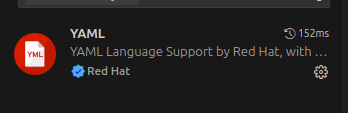
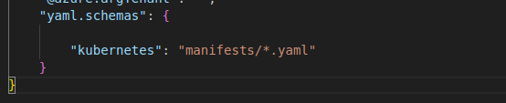

# Pods

Simple repo with everything related to K8s manifests

## VS Code Extension

Search for `redhat.vscode-yaml` in extensions. Once installed configure the extension to support K8s.

Click the Gear Icon and select...settings, then scroll down to schemas and select edit in settings.json.

The extension will now help with syntazx for all yaml files within manifest folders. 