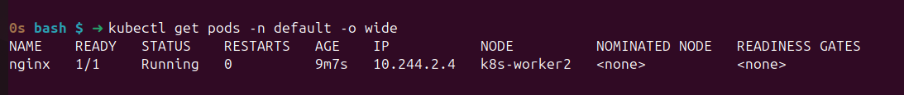
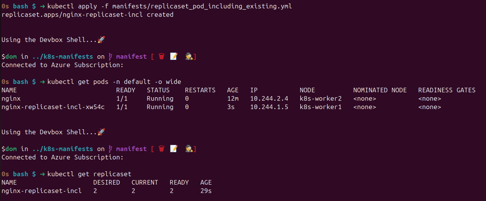
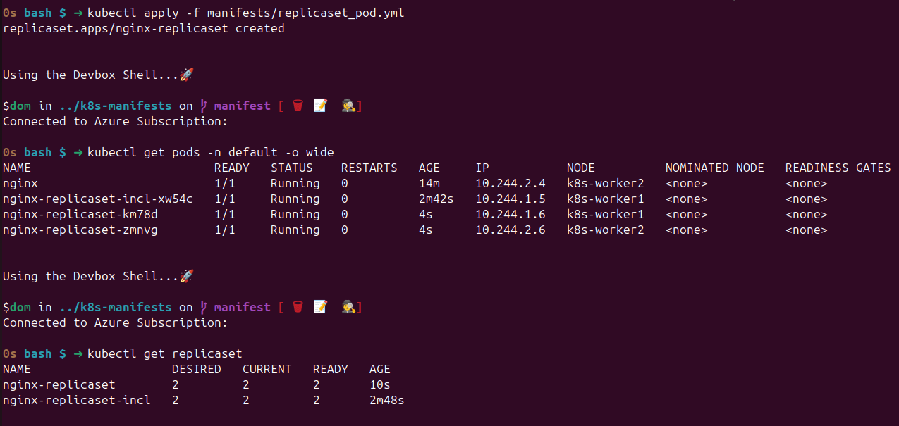
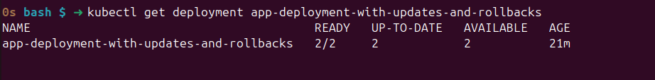
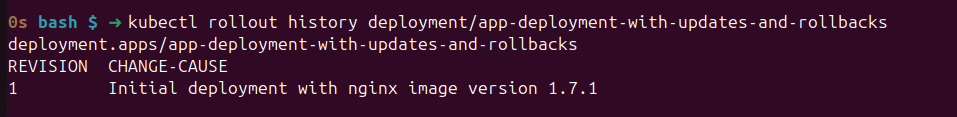
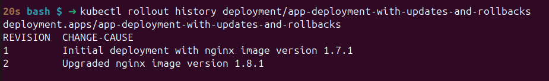
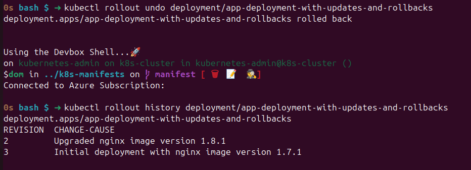
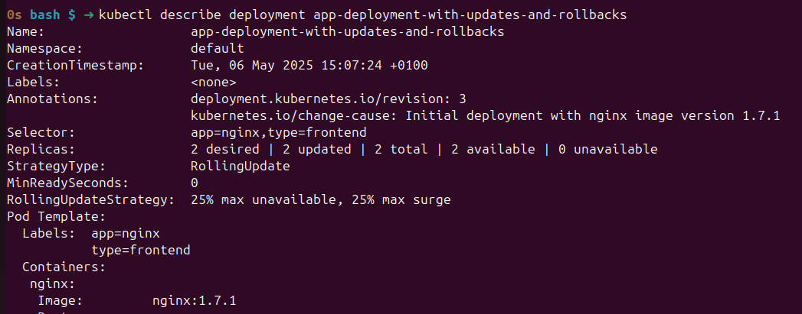
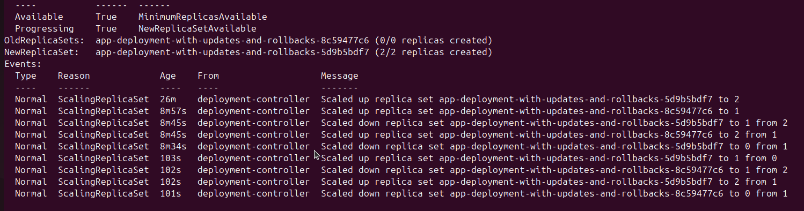

# K8s Resource Types

## VS Code Extension

Search for `redhat.vscode-yaml` in extensions. Once installed configure the extension to support K8s.


Click the Gear Icon and select...settings, then scroll down to schemas and select edit in settings.json.


The extension will now help with syntazx for all yaml files within manifest folders. 


## Pods

Deploys a single pod to a K8s node.

[single pod](manifests/nginx_pod.yml)

```shell
kubectl apply -f manifests/nginx_pod.yml
```




## ReplicaSet

Deploys a given number of pods as defined by replicas to thw k8s nodes.
The replicaset uses labels to determine which pods are part of a replicaset. 

The examples below show replicaset which consume existing pods as their labels match and a replicaset with newly built pods.

You could deploy a single pod with a replicaset to ensure you always have a pod running for that application.


[replica set incl. pod above](manifests/replicaset_pod_including_existing.yml)

```shell
kubectl apply -f manifests/replicaset_pod_including_existing.yml
```



[replica set](manifests/replicaset_pod.yml)

```shell
kubectl apply -f manifests/replicaset_pod.yml
```



## Deployments

Deployments allow you to control how pods are deployed, updated, rolled back - by default using Rolling Update.

```shell
kubectl apply -f manifests/deploy_nginx_with_updates_and_rollbacks.yml
```




You can review a deployment's status and history using...

```shell
kubectl rollout status deployment/app-deployment-with-updates-and-rollbacks #<- this the name within the yaml definition.

# and review history using

kubectl rollout history deployment/app-deployment-with-updates-and-rollbacks
```



Everytime an deployment is updated; you should change the annotation as per the example below...

```yaml
...
kind: Deployment
metadata:
  ...
  annotations:
    kubernetes.io/change-cause: "Initial deployment with nginx image version 1.7.1"
...
```

```yaml
...
kind: Deployment
metadata:
  ...
  annotations:
    kubernetes.io/change-cause: "Upgraded nginx image version 1.8.1"
...
```



and should you need to rollback, you can simply run 

```shell
kubectl rollout undo deployment/app-deployment-with-updates-and-rollbacks
```

and check the history again...

```shell
kubectl rollout history deployment/app-deployment-with-updates-and-rollbacks
```



and use describe to see what happened.

```shell
kubectl describe deployment app-deployment-with-updates-and-rollbacks
```






